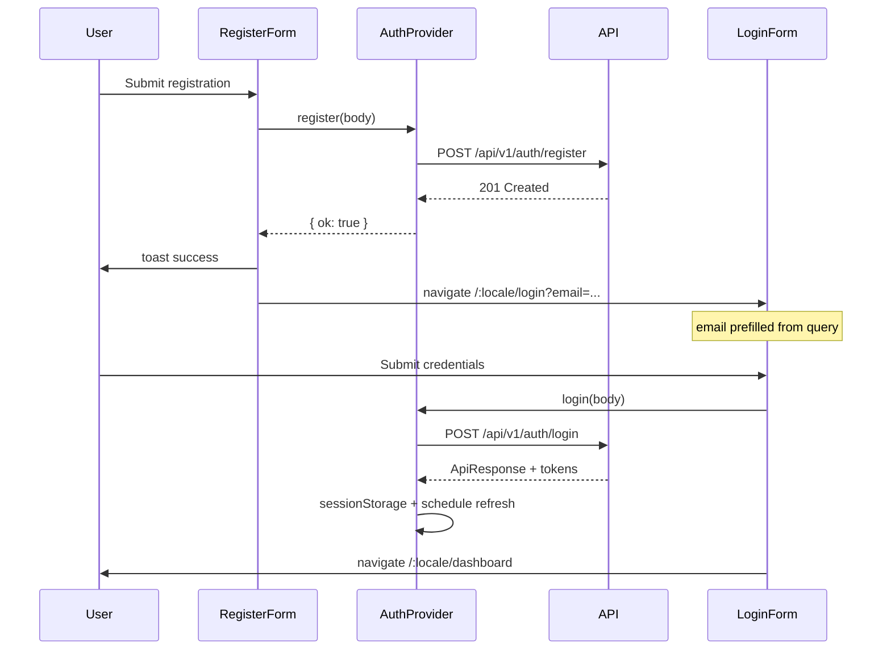

# Auth feature

Client-side authentication for Darb: registration, login, JWT session, token refresh, and change password.

## API endpoints

Base URL: `VITE_API_URL` or `http://localhost:8080`. All paths below are relative to that origin.

| Function | Method | Path | Auth header | Request body | Response |
| --- | --- | --- | --- | --- | --- |
| `register` | `POST` | `/api/v1/auth/register` | No | `RegisterRequestBody` (JSON) | `201` empty body |
| `login` | `POST` | `/api/v1/auth/login` | No | `{ email, password }` | `ApiResponse<AuthResponse>` |
| `refresh` | `POST` | `/api/v1/auth/refresh` | No | `{ refreshToken }` | `ApiResponse<AuthResponse>` |
| `changePassword` | `POST` | `/api/v1/auth/change-password` | Bearer access token | `{ currentPassword, newPassword }` | `ApiResponse<void>` |

`RegisterRequestBody` fields: `fullName`, `email`, `password`, optional `phone`, `role` (`student` \| `teacher` \| `parent` \| `mosque_admin`), `gender` (`MALE` \| `FEMALE`), `dateOfBirth` (`YYYY-MM-DD`).

`AuthResponse` (in `data` on login/refresh): `accessToken`, `refreshToken`, `tokenType`, `expiresIn`, `userId`, `fullName`, `role`, `email`.

Automatic refresh on 401 for `auth: true` requests is handled in `src/lib/api-client.ts`, not duplicated in this module.

## Public exports (`index.ts`)

Import from `@/features/auth` (or relative `../features/auth`):

| Export | Kind |
| --- | --- |
| `AuthProvider` | React provider (wrap app once) |
| `useAuth` | Hook: `user`, `isAuthenticated`, `isLoading`, `login`, `logout`, `register`, `changePassword` |
| `AuthActionResult`, `AuthContextValue` | Types for provider results |
| `ApiResponse`, `AuthResponse`, `UserSession`, `Gender`, `RegisterRole` | Types |
| `LoginRequestBody`, `RegisterRequestBody`, `ChangePasswordRequestBody` | Request types |
| `login`, `register`, `refresh`, `changePassword` | Low-level API functions |
| `normalizeRole`, `RoleKey` | Role string normalization for UI/i18n |

UI components (`LoginForm`, `RegisterForm`, `AuthShell`, etc.) are **not** re-exported from the barrel; pages import them directly from `components/`.

## Register → login flow

Steps in code:

1. **`RegisterForm`** — validates with `registerSchema`, calls `useAuth().register(toRegisterRequestBody(...))`.
2. On success — `toast.success`, then `navigate(\`/${locale}/login?email=...\`, { replace: true })`. No tokens are issued at registration.
3. **`LoginForm`** — reads `email` from `useSearchParams()`, calls `useAuth().login`.
4. On success — navigates to `/${locale}/dashboard`; `GuestRoute` would redirect authenticated users away from login anyway.

On validation or conflict errors, `AuthProvider` returns `fieldErrors` when the API puts field messages in `data`; `applyFieldErrors` sets react-hook-form errors and shows a translated toast for the top-level `message`.
